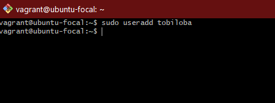
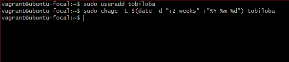
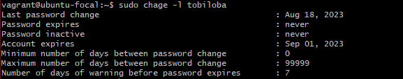
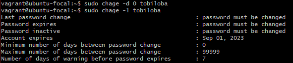

# Linux User Management Guide

In this guide, we'll cover the process of creating and managing users on a Linux system using the command line.

1. Open a terminal.

2. 
   I created a user named "tobiloba".

3. 
   The expiry date of the user account was set to two weeks after it was created.

4. 
   The expiry date of the user account was confirmed.

5. 
   The user was prompted to change their password on their next login.

6. 
   I created a new group called "altschool".

7. 
   I added the user "tobiloba" to the "altschool" group.

8. 
   I edited the sudoers file to allow the "students" group to run the `cat` command on files in the `/etc/` directory.

9. 
   I created a user named "nohometobiloba" without a home directory.
